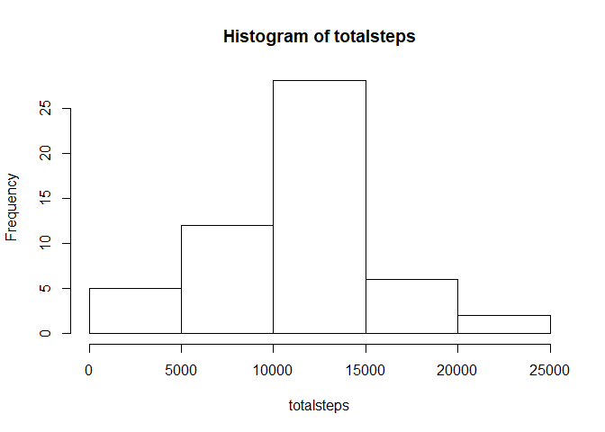
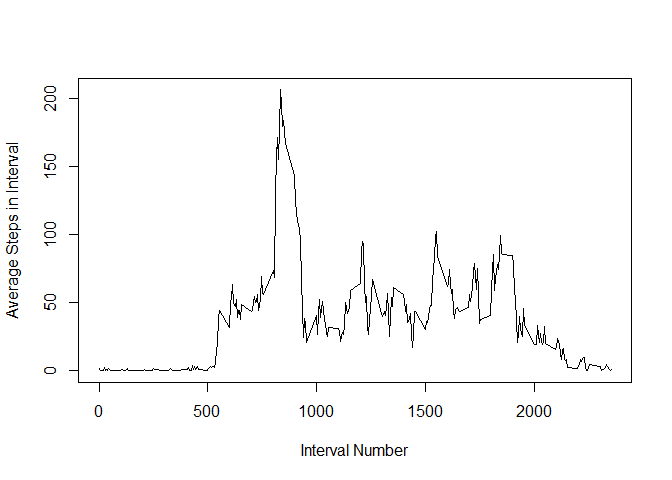
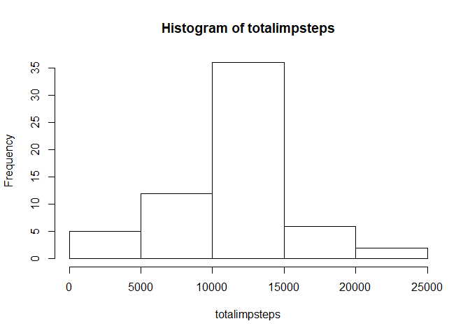
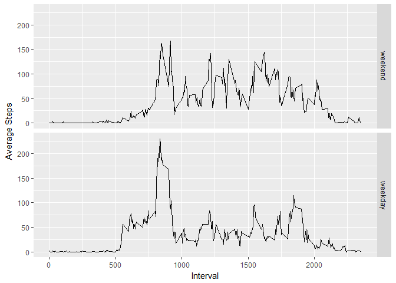

## Loading and preprocessing the data
The data is located in a zip file called "activity.zip." It will be read in by using read.csv and unzip in the same command. It is assumed that the file is in the working directory. I will also change the class of the date column to "date."


```r
stepdata <- read.csv(unzip("./activity.zip"))
stepdata$date <- as.Date(stepdata$date)
```

The columns, "steps," "date," and "interval" are of the classes "integer," "date," and "integer" for now.

## What is mean total number of steps taken per day?

First I sum the steps per day using tapply. Then I provide a histogram of the daily step totals.


```r
totalsteps <- with(stepdata, tapply(steps, date, sum))
hist(totalsteps)
```

<!-- -->

Now to calculate the mean and median of the total steps per day. Based on this histogram, it should be between 10000 and 15000.


```r
# use na.rm to remove NA values. Otherwise, R will return "NA" as the mean and median
totalstepsmean <- mean(totalsteps, na.rm=TRUE)
totalstepsmedian <- median(totalsteps, na.rm=TRUE)
totalstepsmean
```

```
## [1] 10766.19
```

```r
totalstepsmedian
```

```
## [1] 10765
```

Wow! Look how close the two numbers are! Right where we predicted.

## What is the average daily activity pattern?

Now we want to see a plot of the average of the steps taken in each five minute interval over all days that data was collected.

To do this, I will use my favorite function: tapply.


```r
avgstepsinterval <- with(stepdata, tapply(steps, interval, mean, na.rm=TRUE))
plot(names(avgstepsinterval), avgstepsinterval, type="l", xlab="Interval Number", ylab = "Average Steps in Interval")
```

<!-- -->

Check that out! The highest value loks to be around interval 900. Let's figure out the actual number.


```r
avgstepsinterval[avgstepsinterval == max(avgstepsinterval)]
```

```
##      835 
## 206.1698
```

It would appear that the max value is 206.1698 and this occurs at time interval #835.

## Imputing missing values

First of all, let's find out how many NA values there are in the step column.


```r
sum(is.na(stepdata$steps))
```

```
## [1] 2304
```

Wow! 2304 values! Considering there are 17568 rows in the dataset, that's not an insignificant number. Having this many missing values can throw off the data so we'll have to impute the missing values somehow.

A suggestion given in the assignment instructions is to impute the data based on the average steps in that particular interval.

I do this in the following code. First I copy the dataset into a new variable called "impdata".

Then I add a new column called "avginterval" which takes the average steps per interval calculated before and repeats the values for as many days as there are in the dataset.

Then I replace the NA values in the steps column with the average steps per interval. It will return a warning which I don't quite understand.


```r
impdata <- stepdata

impdata$avginterval <- rep.int(avgstepsinterval, length(impdata$interval)/length(avgstepsinterval))

impdata$steps <- replace(impdata$steps, is.na(impdata$steps), impdata$avginterval)
```

```
## Warning in x[list] <- values: number of items to replace is not a multiple
## of replacement length
```

Here is a histogram of the total daily steps of the new dataset with imputed values.


```r
totalimpsteps <- with(impdata, tapply(steps, date, sum))
hist(totalimpsteps)
```

<!-- -->

Looking at this histogram compared to the first one, we see that there are about 10 more days in the 10k - 15k range! Let's find out the mean and median of this new imputed data and then compare them to the original values.


```r
totalimpstepsmean <- mean(totalimpsteps)
totalimpstepsmedian <- median(totalimpsteps)
totalimpstepsmean
```

```
## [1] 10766.19
```

```r
totalimpstepsmedian
```

```
## [1] 10766.19
```

```r
totalimpstepsmean - totalstepsmean
```

```
## [1] 0
```

```r
totalimpstepsmedian - totalstepsmedian
```

```
## [1] 1.188679
```

Imputing the data had no effect on the mean! And it had a tiny effect of adding a whole step to the median!

## Are there differences in activity patterns between weekdays and weekends?

Now we are going to check the difference between the average number of steps per interval changes at all depending on if it is a weekend or a weekday.

Using the R command "weekdays()," we can get the day of the week of each date and then split the data by Weekday or Weekend.

For the following section of code, I got help from the following discussion on StackOverflow: https://stackoverflow.com/questions/28893193/creating-factor-variables-weekend-and-weekday-from-date


```r
weekday <- c("Monday", "Tuesday", "Wednesday", "Thursday", "Friday")
impdata$weekday <- factor((weekdays(impdata$date) %in% weekday), levels=c(FALSE, TRUE), labels=c("weekend", "weekday"))
```

Now we can average each interval by each factor using, you guessed it, tapply:


```r
weekdaydata <- with(impdata, tapply(steps, list(weekday, interval), mean))
```

I want to use ggplot and the "weekdaydata" is in a matrix which doesn't play nice with ggplot. So I will melt the data using "reshape2" into a data frame.


```r
library(reshape2)
weekdaydata <- melt(weekdaydata)
colnames(weekdaydata) <- c("weekday", "interval", "steps")
```

Now that we have the data in a data frame, it's time to plot it. I will load in ggplot and then plot interval on the x axis and average steps on the y axis. The plot will be split into two panels with one representing weekday data and one representing weekend data.


```r
library(ggplot2)
g <- ggplot(weekdaydata, aes(interval, steps)) + geom_line() + facet_grid(weekday~.) + labs(x="Interval", y="Average Steps")
print(g)
```

<!-- -->
